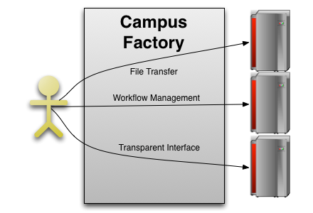



<h1>Campus Factory</h1>

A lightweight glidein factory designed to connect campus resources together into a on-demand Condor cluster

<a href="https://github.com/djw8605/campus-factory/zipball/v1.0" class="btn btn-primary btn-large">
Download v1.0
</a>
<a class="btn btn-info btn-large" href="about.html">
Learn More
</a>

<h2>Production Software</h2>

The Campus Factory is built on production software such as <a href="http://research.cs.wisc.edu/condor/">Condor</a> and <a href="http://www.uscms.org/SoftwareComputing/Grid/WMS/glideinWMS/">GlideinWMS</a> libraries.

 <!-- END SPAN -->

<h2>Simple Configuration</h2>

Configuration file is in standard ini format.  Simple to customize the ini style configuration.

 <!-- END SPAN -->

<h2>Condor Integration</h2>

The Campus Factory is integrated with <a href="http://research.cs.wisc.edu/condor/">Condor</a>, the High Throughput Computing resource manager

 <!-- END SPAN -->

<h2> Simple Use </h2>

Its as easy as submitting a condor job: 

<pre>
<code>universe = vanilla
executable = my-processing.exe
transfer_input_files = input1, input2
should_transfer_files = YES
WhenToTransferOutput = ON_EXIT
queue 1000</code> 
</pre>

<dl>

<dt>unverse</dt>
<dd>Tells Condor to run the executable direectly.</dd>

<dt>executable</dt>
<dd>The file to execute on the worker node.</dd>

<dt>transfer_input_files</dt>
<dd>Lists the files that should be transferred to the execution node with the executable before starting.</dd>

<dt>should_transfer_files and WhenToTransferOutput</dt>
<dd>Tell Condor to transfer the files to the execution host before starting.</dd>

<dt>queue</dt>
<dd>This is the last line in any Condor submit file.  It means to submit <code>1000</code> copies of this job.</dd>

</dl>

<ul>
<li><code>universe</code> tells Condor to run the <code>executable</code> directly.  </li>

<li><code>transfer_input_files</code> lists the files that should be transferred to the execution node with the executable before starting.  <code>should_transfer_files</code> and <code>WhenToTransferOutput</code> both tell Condor to transfer the files to the execution host before starting.  </li>

<li>
<code>queue</code> is the last line in any Condor submit file.  It means to submit <code>1000</code> copies of this job.
</li>
</ul>

<!-- end span -->

<h2>Enabling Science</h2>

The Campus Factory provides an on-demand personal cluster by combining shared resources into a consistent and transparent environment.  Workflow management is handled by integration with <a href="http://research.cs.wisc.edu/condor/">Condor</a>.  Researchers are able to spend less time worrying about the computing, and more time on their research.

 <!-- end span -->

 

